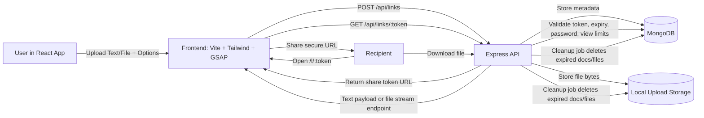

# LinkVault Data Flow

```mermaid
flowchart LR
  U[User in React App] -->|Upload Text/File + Options| FE[Frontend: Vite + Tailwind + GSAP]
  FE -->|POST /api/links| BE[Express API]
  BE -->|Store metadata| DB[(MongoDB)]
  BE -->|Store file bytes| FS[(Local Upload Storage)]
  BE -->|Return share token URL| FE
  FE -->|Share secure URL| R[Recipient]
  R -->|Open /l/:token| FE
  FE -->|GET /api/links/:token| BE
  BE -->|Validate token, expiry, password, view limits| DB
  BE -->|Text payload or file stream endpoint| FE
  R -->|Download file| BE
  BE -->|Cleanup job deletes expired docs/files| DB
  BE -->|Cleanup job deletes expired docs/files| FS
```
